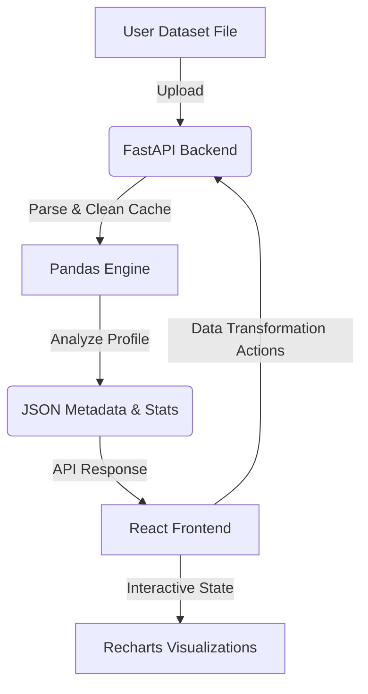

# Panboard 📊

Panboard is a modern, high-performance **Dashboard-as-a-Service** application. It allows users to upload raw datasets, instantly profile them, clean or transform columns interactively, and view beautifully structured statistical visualizations in real-time.



---

## ✨ Features

- **🚀 Versatile File Upload**: 
  - Supports **CSV**, Excel sheets (**`.xls`**, **`.xlsx`**, **`.xlsm`**, **`.xlsb`**), and OpenDocument spreadsheets (**`.ods`**).
  - Seamless case-insensitive format detection.
- **🧹 Real-time Interactive Transformations**:
  - **Imputation**: Handle missing data dynamically with `mean`, `median`, `mode`, or static custom values.
  - **Type Casting**: Convert column datatypes on the fly to `integer`, `float`, `string`, or `datetime`.
  - **Filtering**: Apply complex data filters (`==`, `!=`, `>`, `<`, `>=`, `<=`, `contains`).
  - **Renaming**: Update column names instantly.
  - **Reset**: Revert all operations and restore the dataset to its original uploaded state.
- **📈 Advanced Visual Analytics**:
  - Automatically identifies numeric and categorical columns.
  - Computes central tendencies (mean, median, standard deviation, min, max) and null distributions.
  - Dynamic correlation matrix showing relationships between numerical variables.
  - Interactive distribution bar charts for categorical values.
- **💾 Optimized Sessions & Caching**:
  - Leverages a secure disk-based serialization (`pickle`) cache mechanism with a 30-minute automatic eviction cycle to handle large files efficiently.

---

## 🛠️ Tech Stack

### Backend
- **Core**: [FastAPI](https://fastapi.tiangolo.com/) (Python)
- **Data Engine**: [Pandas](https://pandas.pydata.org/)
- **Excel Engines**: `openpyxl`, `xlrd`, `pyxlsb`, `odfpy`
- **Package Manager**: [uv](https://github.com/astral-sh/uv) (Ultra-fast cargo-like resolver)

### Frontend
- **Framework**: [React 19](https://react.dev/) + [TypeScript](https://www.typescriptlang.org/)
- **Build Tool**: [Vite 8](https://vite.dev/)
- **Visualizations**: [Recharts 3](https://recharts.org/)
- **Styling**: [Tailwind CSS 4](https://tailwindcss.com/)
- **Runtime/Package Manager**: [Bun](https://bun.sh/)

---

## 🚀 Getting Started

### Prerequisites
- **Python**: `>=3.13`
- **uv**: [Installation Guide](https://github.com/astral-sh/uv#installation)
- **Bun**: [Installation Guide](https://bun.sh/#installation)

---

### 1. Backend Setup (FastAPI)

Navigate to the `backend` directory:
```bash
cd backend
```

#### Sync Dependencies
Ensure all packages and engines are installed in the virtual environment:
```bash
uv sync
```

#### Run Development Server
Start the server using `uvicorn`:
```bash
uv run uvicorn main:app --host 0.0.0.0 --port 8000 --reload
```
The API documentation will be available locally at `http://127.0.0.1:8000/docs`.

#### Run Tests
Execute the pytest suite (includes 14 tests for file parsing, imputation, casting, renaming, filtering, and resetting):
```bash
uv run pytest
```

---

### 2. Frontend Setup (React)

Navigate to the `frontend` directory:
```bash
cd frontend
```

#### Install Dependencies
```bash
bun install
```

#### Run Development Server
```bash
bun run dev
```
Open `http://localhost:5173` in your browser.

#### Build for Production
Compiles TypeScript files and bundles with Vite:
```bash
bun run build
```

---

## 🔌 API Endpoints Summary

### 1. `GET /`
- **Description**: API health check.
- **Response**: `{"message": "Dashboard as a Service API is running"}`

### 2. `POST /api/upload`
- **Description**: Upload and profile a dataset.
- **Request Form**: `file` (Multipart file upload)
- **Response**: JSON payload containing:
  - `dataset_id`: Unique session UUID.
  - `columns`, `numeric_columns`, `categorical_columns`.
  - `row_count`.
  - `info`: Types, missing values count, unique values count per column.
  - `stats`: Numerical summaries.
  - `categorical_summary`: Top values distributions.
  - `correlation`: Heatmap data.
  - `sample_data`: First 100 rows.

### 3. `POST /api/transform/{dataset_id}`
- **Description**: Transform the current state of a cached dataset.
- **Request JSON Body**:
  ```json
  {
    "action": "impute | cast | rename | filter | reset",
    "column": "column_name",
    "strategy": "mean | median | mode | value",  // For imputation
    "fill_value": "custom_val",                  // For imputation
    "data_type": "int | float | str | datetime", // For casting
    "new_name": "new_column_name",               // For renaming
    "operator": "== | != | > | < | >= | <= | contains", // For filtering
    "value": "comparison_val"                    // For filtering
  }
  ```
- **Response**: Refreshed data profile and stats JSON.

---

## 🔒 License

Distributed under the MIT License. See `LICENSE` for details.
